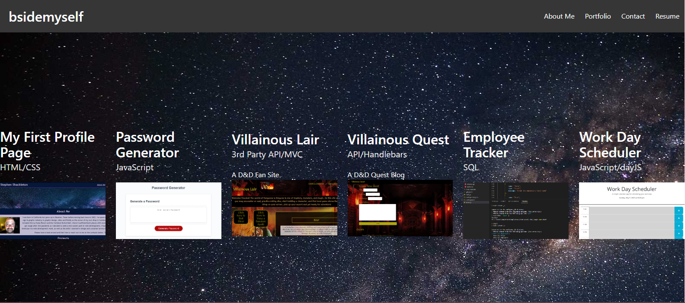
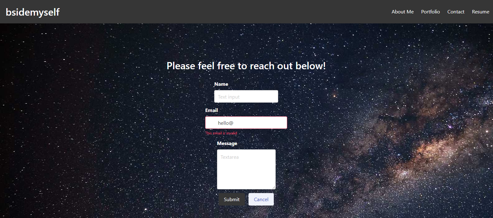

# React App Portfolio
## Description
The purpose of this project was to develop a React based app that is my personal portfolio.
## Challenges
I started by building a template for the site as a standard HTML set of pages. Then I was working on trying to pull those elements into components and pages for the React app, but did not finish as I stopped to work on the second group project.  I plan to continue to build this up to full functionality but I wanted to have something to turn in.
## Tech Used
React, ReactDOM, HTML, Javascript and CSS
## Screenshot of Template
Here is a shot of what I was trying to recreate:

